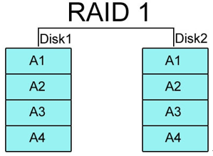

# MSSQL
***필자 사용 환경 기반***
- [습관](#습관)
- [DBMS](#dbms)
    - [RAID](#raid)
    - [파일그룹](#파일그룹)
- [SSMS](#ssms)
- [명령어](#명령어)
- [테이블 변수](#테이블-변수)
- [데이터 무결성](#데이터-무결성)
- [DB 설계](#db-설계)
- [특징](#특징)
---
## 습관
SSMS에서 CRUD 시 ROLLBACK이 불가능 하기 때문에, **BEGIN TRAN**을 사용하여 하위 쿼리로 인한 데이터 손실, 오입력을 방지합니다. <br />
실행 결과가 잘못 되었다면 **ROLLBACK**을 사용하며, 옳을 결과물이 나오면 **COMMIT**을 실행합니다.
```sql
BEGIN TRAN

UPDATE  a 
SET	a.step_3_name = b.step_3_name
FROM    acccost a 
JOIN	acccost_2 b
on   	a.dstyleno = b.dstyleno     -- KEY 총 4개.
AND	a.step_1 = b.step_1
AND	a.step_2 = b.step_2
AND	a.step_3 = b.step_3
;

ROLLBACK
COMMIT
```
---
## DBMS
데이터베이스 관리 시스템(DataBase Management System)은 다수의 사용자들이 DB 내의 데이터를 동시에 접근하여 사용할 수 있도록 합니다.

### 구조
- 데이터 파일
    - 테이블
        - 필드
            - 타입
            - 길이
            - 제약조건
- 로그 파일
    - 중간 단계
        - 트랜잭션

### 관리
- 데이터 관리 : 데이터 접근(다중 접근)
- 백업/복원
- 권한 제어
- 24/365 - 이중화로 임시DB를 만들어서 Master DB 복구 시점까지 대체.

### 특징
- 실시간 접근성
    - ms
- 계속적인 변화
    - 삽입, 수정, 삭제 등
- 동시성
    - 다수의 Client가 동시에 동일 데이터에 접근
- 내용에 의한 참조
    - 실제 데이터를 가지고 검색

### 장점 - 중앙 관리
- 데이터 중복의 최소화 
- 데이터 독립성 유지
- 데이터의 공유
- 보안성/무결성/일관성 유지

### 단점
- Overhead 발생
- 운영 비용 증가
- 오류 발생 시 복구 복잡.

### OLTP와 OLAP
- OLTP : Online Transaction Processing 
    - 실시간 실행
- OLAP : Online Analytical Processing
    - 통계, 분석
    - Analysis Service / Reporting Service

### RAID
Redundant Array of Inexpensive Disks, 여러 개의 디스크를 배열하여 속도/안정성/효율성/가용성을 향상시키는 기술입니다.
- RAID 0 <br />
Concatenate, Stripe로 총 두 가지 방법이 있습니다. **중복 블록이 존재하지 않아서** 사용 가능 용량은 모든 디스크를 합친 용량입니다. 디스크 일부에 장애가 발생하면, 복구가 어렵고 패리티를 지원하지 않는다는 단점이 있습니다. 
    - Concatenate <br />
    두 개 이상의 디스크를 **순차적으로 사용**합니다. 디스크 공간이 부족해도 데이터를 보존하며 용량 증설이 가능합니다.
        <p align="center"></p>

    - Stripe(**RAID 0는 보통 Stripe**) <br />
    데이터를 두 개 이상의 디스크에 **분산 저장**합니다. I/O를 디스크 수만큼 분할하기 때문에 I/O속도가 향상되며, 디스크를 늘릴 시 기존 데이터는 모두 삭제 되어야 합니다.
        <p align="center"></p>

- RAID 1(Mirror) <br />
2개 이상의 디스크로 구성되고 패리티를 사용하지 않으며, 같은 데이터를 중복 기록합니다. 
    - 장점 : 볼륨 내 디스크 중 하나만 정상이여도 데이터 보존이 가능하기 때문에 **가용성이 높고 상대적으로 복원이 간단**합니다. 
    - 단점 : **용량이 기본의 절반**으로 줄고, 미러링으로 인해 **입력 속도가 느려**집니다.
        <p align="center"></p>


- RAID 2 <br />
RAID 0의 Stripe에서 에러 체크와 수정을 할 수 있도록 **Hamming code**를 사용합니다. 하드 디스크에서 ECC(Error Correction Code)를 지원하지 않기 때문에 ECC를 별도의 드라이브에 저장합니다. **RAID 4가 나온 이후 거의 사용되지 않습니다.**
        <p align="center"></p>
- RAID 3 & RAID 4 <br />
RAID 0, 1의 단점을 보완하기 위해 나온 방식으로, 기본적으로 RAID 0의 Stripe로 구성되며 성능 보완과 디스크 용량을 온전히 사용하는 것을 보장합니다. 추가로 **패리티**정보를 별도 디스크에 저장합니다. RAID 3는 데이터를 **바이트 단위**로 나누어 디스크에 동등하게 분산 기록하며, RAID 4는 **블록 단위**로 나눠 기록합니다. **RAID 3는 드라이브 동기화가 필수적**이라 많이 사용되진 않습니다.
    - 단점 : 패리티 정보를 한 디스크에 저장하기 때문에 손상 시 데이터 복구가 어려울 수 있습니다.
        <p align="center"></p>
- RAID 5 <br />
RAID 3, 4에서 별도의 패리티 정보 디스크를 사용하여 발생하는 문제점을 보완한 방식으로 정보를 Stripe로 구성된 디스크 내에서 처리합니다.
    - 장점 : 1개의 하드가 고장나도 남은 하드를 통해 데이터를 복구할 수 있으며, 성능/안전성/용량 세 부분을 모두 고려하기 때문에 실제로 많이 사용됩니다.
    - 단점 : RAID 0보다 성능이 부족합니다.
        <p align="center"></p>
- RAID 6 <br />
RAID 5와 같지만, 다른 드라이브들 간에 분포되어 있는 2차 패리티 정보를 넣는다는 점에서 차이가 있습니다. RAID 5에서 데이터 안전성을 더욱 고려한 방식입니다.
    - 장점 : 2개의 하드에서 문제가 생겨도 복구 가능합니다.

### 파일그룹
- 파일을 관리하기 위한 논리적인 그룹
    - 데이터 파일(*.mdf, *.ndf)
- 성능향상을 위해 서로 다른 드라이브에 생성/운영합니다.
    - RAID 0 같은 효과를 보입니다.

---
## SSMS
SQL Server Management Studio
- SQL Server 관리
    - 서버 설정 변경, DB 생성, 테이블 생성
    - 보안(계정 설정, 권한)
    - 백업/복원
- 개발
    - 스토어 프로시져
    - 트리거
---
## 명령어
- USE : 사용할 DB 연결
    ```sql
    USE testDb;
    ```
- GO : 배치 단위를 구분. 독립/순차적으로 실행.
    ```sql
    SELECT * FROM 테이블
    GO
    SELECT * FROM 테이블2
    GO
    ```
- SERVERPROPERTY('collation') : 정렬 기본 값 조회
    ```sql
    SELECT SERVERPROPERTY('collation')
    -- Korean_Wansung_CI_AS : 한글 완성형 대소문자 구분 없이
    -- Korean_Wansung_CS_AS : 한글 완성형 대소문자 구분.
    ```
- DECLARE : 변수 선언
    ```sql
    DECLARE @num INT;       -- 선언, 필드 명과 구분짓기 위해 '@'를 사용
    DECLARE @메모 CHAR(MAX) -- 최대 크기 선언
    SET     @num = 15000;   -- 초기화
    -- 초기화를 하지 않으면 NULL로 되어 있기 때문에, 연산 불가능.

    SET     @num = @num * 5;
    SELECT  @num AS '총합';       -- 출력
    ```
- CHAR 와 VARCHAR의 차이
    ```sql
    DECLARE @품목1 VARCHAR(10);
    -- 10바이트 가변 길이 문자
    -- 가변 문자는 편하긴 하지만, 메모리 낭비가 존재합니다.

    DECLARE @품목2 NVARCHAR(5); 
    -- 10바이트 유니코드(한 자당 2바이트) 가변 길이 문자
    -- 1바이트 짜리 문자도 2바이트로 취급합니다.
    -- 관리의 편의성을 위합니다.
    
    DECLARE @상품코드 CHAR(5);  
    -- 고정 길이 문자 
    ```
- SYSDATETIME() : 시간
    ```sql
    SYSDATETIME() : 현재 시간
    SYSDATETIMEOFFSET() : 표준 시간대
    ```
- NEWID() : Unique Identifier
    ```sql
    SELECT NEWID();

    CREATE TABLE 고객
    (
        고객번호 UNIQUEIDENTIFIER,
        고객이름 NVARCHAR(20)
    );

    INSERT INTO 고객
    VALUES      (NEWID(), '이승원');
    ```
- DATEDIFF : 날짜 차 구하기
    ```sql
    SELECT DATEDIFF(dd, '2022-01-01', '2022-12-31') + 1
    -- 365

    CREATE TABLE 휴가
    (
        순번        INT,
        직원코드    CHAR(5),
        휴가시작일  DATE,
        휴가종료일  DATE,
        휴가사유    NVARCHAR(256),
        휴가기간    AS (DATEDIFF(DAY, 휴가시작일, 휴가종료일) + 1)
        -- 계산된 열
        -- 끝에 PERSISTED 추가 하면, 화면에 출력될 때 계산하는 것이 아닌, 계산된 상태로 저장하여 출력 속도가, 보다 빠릅니다.
    )
    ```
- IDENTITY
    ```sql
    CREATE TABLE    휴가 (
        순번    INT IDENTITY            -- 1씩 증가
        순번2   INT IDENTITY(100, 2)    -- 100부터 2씩 증가 
    )
    ```
- @@IDENTITY : 현재 세션에 의해 영향 받은 TABLE의 IDENTITY 필드 마지막 값
    ```sql
    SELECT @@IDENTITY;
    ```    
- DBCC
    ```sql
    DBCC CHECKIDENT('테이블명', NORESEED);      -- IDENT 증가 값 확인
    DBCC CHECKIDENT('테이블명', RESEED, 10000); -- IDENT의 시작 값 10000으로 변경
    ```
- SCOPE_IDENTITY() : 현재 테이블의 IDENTITY를 출력합니다.
    ```sql
    SELECT SCOPE_IDENTITY();
    ```
- IDENT_CURRENT('테이블명') : 해당 테이블의 IDENTITY를 출력합니다.
    ```sql
    SELECT IDENT_CURRENT('휴가');
    ```
- IDENTITY_INSERT : INSERT 시, 속성 매칭 오류, 혹은 [IDENTITY](#identity)로 인해 수정 불가능한 문제 등을 해결합니다. 한 세션에서 한 테이블만 ON해줄 수 있습니다.
    ```sql
     SET    IDENTITY_INSERT 테이블명 ON;
     INSERT /*
            */
     SET IDENTITY_INSERT 테이블명 OFF;
    ```
- SYS.KEY_CONSTRAINTS : PK, UQ 등을 포함한 정보를 출력합니다.
    ```sql
    SELECT * FROM SYS.KEY_CONSTRAINTS;
    ```
- CONSTRAINT : 제약 조건 수정
    ```sql
    ALTER TABLE 테이블명            
    DROP CONSTRAINT PK명;    -- 테이블의 PK삭제.
    -- SYS.KEY_CONSTRAINTS로 조회된 name이 PK명입니다.

    ALTER TABLE 테이블명
    ADD PRIMARY KEY (컬럼명); 
    -- PK 추가. 단, 해당 컬럼에 중복이 존재하지 않아야 합니다. 

    ALTER TABLE 테이블명
    ADD UNIQUE (컬럼명)
    ```
- DEFAULT : 기본 값
    ```sql
    CREATE TABLE 고객
    (
        고객번호 INT PRIMARY KEY IDENTITY(1, 1),
        마일리지 INT DEFAULT 500
    )
    ```
- CHECK : 특정 조건 만족 시 입력됩니다. 같은 테이블의 다른 컬럼 참조가 가능합니다.
    ```sql
    ALTER TABLE		휴가
    ADD CHECK		(휴가종료일 >= 휴가시작일);
    ```
---
## 테이블 변수
메모리에 일시적+으로 생성되는 테이블로, 복잡한 쿼리 작성 시 임시 변수 기능을 합니다.
```sql
DECLARE @고객 TABLE
(
    고객번호    CHAR(5),
    고객명      NVARCHAR(20),
    전화번호    NVARCHAR(20) 
)
INSERT INTO @고객 (고객번호, 고객명, 전화번호)
VALUES		('12345', '이승원', '010-1111-1111')
			,('12346', '이승투', '010-1111-2222')
			,('12347', '일승원', '010-1111-3333');

UPDATE @고객
SET		전화번호 = '101'
WHERE	고객번호 = '12345';

SELECT * FROM @고객
/*
12345	이승원	101
12346	이승투	010-1111-2222
12347	일승원	010-1111-3333
*/
```
---
## 데이터 무결성
잘못된 데이터 입력을 예방합니다.
음
---
## DB 설계

- master
    ```sql
    CREATE DATABASE db_mis03;
    ```
- db_mis03
    ```sql
    CREATE DATABASE db_mis03;
	GO

	USE db_mis03;
	CREATE TABLE t_company
	(
		f_comp_code		CHAR(1)	PRIMARY KEY
		, f_comp_name	NVARCHAR(20)
	)
	GO

	CREATE TABLE t_department
	(
		f_dept_code		CHAR(3)	PRIMARY KEY
		,f_dept_name	NVARCHAR(20)
		,f_comp_code	CHAR(1)	REFERENCES t_company(f_comp_code)
		,f_start_date	DATE
	)
	GO

	CREATE TABLE t_employee
	(
		f_emp_code			CHAR(5) PRIMARY KEY
		,f_emp_name			NVARCHAR(10)
		,f_emp_eng_name		VARCHAR(50)
		,f_emp_gender		CHAR(1)
		,f_emp_hire_date	DATE
		,f_emp_retire_date	DATE
		,f_dept_code		CHAR(3)	REFERENCES t_department(f_dept_code)
		,f_emp_hp			VARCHAR(20)
		,f_emp_email		VARCHAR(100)
		,f_emp_salary		INT
	)
	GO

	CREATE TABLE t_vacation
	(
		f_vac_num			INT IDENTITY(1,1) PRIMARY KEY
		,f_emp_code			CHAR(5) REFERENCES t_employee(f_emp_code)
		,f_vac_begin_date	DATE
		,f_vac_end_date		DATE
		,f_vac_reason		NVARCHAR(256) DEFAULT '개인 사유'
		,f_vac_duration		AS (DATEDIFF(day, f_vac_begin_date, f_vac_end_date) + 1)
		, CHECK(f_vac_end_date >= f_vac_begin_date)
	)
    ```
---
## 특징
- NULL과 공백('') <br />
컬럼에 공백 값을 INSERT 할 경우 **오라클에선** NULL로 저장 되지만, **MSSQL에서는 NULL과 공백이 구분**됩니다. 공백 값은 ISNULL 조건에 걸리지 않으며, default 값이 설정된 컬럼에 INSERT를 할 때, **공백('')이 아닌 NULL을 사용하거나 생략**해야 합니다.
